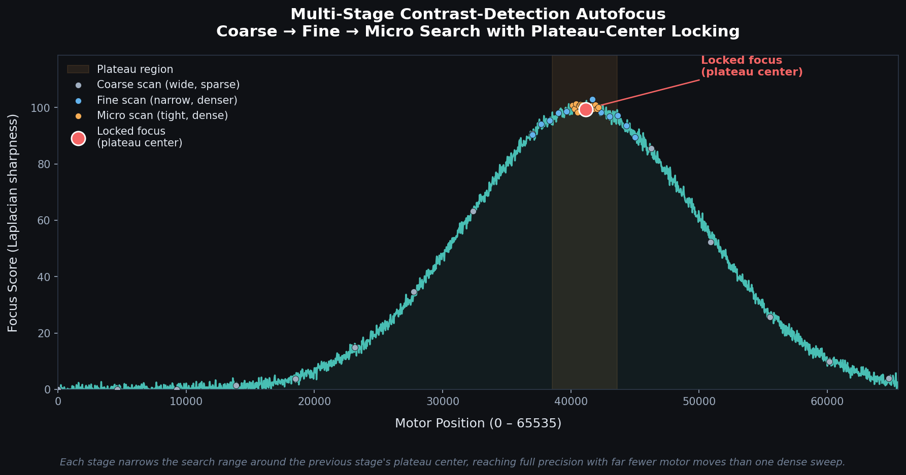

# Plateau Autofocus

A closed-loop, contrast-detection autofocus engine for motorized zoom-lens cameras — built to bridge optical theory (depth of focus, diffraction limit) with real control-systems engineering, and originally developed to generate zoom-to-focus lookup tables (LUTs).



## Why

Most contrast-detection autofocus implementations treat the sharpness-vs-position curve as if it peaks at a single point, and lock onto the single highest-scoring sample. In reality, near best focus the system sits within the lens's **depth of focus**, where blur spot size stays close to the diffraction limit and barely changes with small position shifts — so the curve is flat near the top, not a sharp spike.

Locking onto one sample on that plateau is fragile: mechanical backlash and sensor noise can shift which sample looks "best" from one pass to the next, causing the lock position to jitter. This engine instead locks onto the **center of the plateau**, which is far more repeatable.

## How it works

1. **Sharpness scoring** — the Laplacian of the image approximates its second spatial derivative; its magnitude peaks where spatial-frequency content (edges) is highest. The engine scores the center ROI of each frame using the mean of its top-N highest Laplacian responses, which is more stable than a full variance in low-light or low-detail scenes.

2. **Multi-stage narrowing search** — rather than scanning the full motor range at high resolution, the search narrows in three configurable stages (coarse → fine → micro), each refining around the plateau center found by the previous stage. This reaches full precision with far fewer motor moves than one dense sweep — important for motor wear and speed.

3. **Plateau-center locking** — at each stage, instead of taking the single highest-scoring position, the engine takes the midpoint of all positions within a threshold (default 95%) of the max score.

## Usage

```python
from autofocus_engine import AutofocusEngine

engine = AutofocusEngine(motor_min=0, motor_max=65535)

center = None
for stage in engine.stages:
    positions = engine.positions_for_stage(stage, center)
    scores = [engine.score(capture_frame_at(p)) for p in positions]  # your motor/camera backend
    center = engine.find_plateau_center(scores, positions)

# `center` is now the locked focus position
```

The engine is hardware-agnostic — `capture_frame_at(position)` is left to the caller, so it can be wired up to any motor/lens/camera backend (serial, SDK, etc.). Running this across a full zoom range and recording each locked focus position is how a zoom-to-focus LUT gets built.

## Configuration

All key parameters are exposed on `AutofocusEngine.__init__`:

| Parameter | Default | Description |
|---|---|---|
| `motor_min` / `motor_max` | `0` / `65535` | Full motor travel range |
| `roi_radius` | `40` | Half-width of the center scoring region, in pixels |
| `top_n` | `200` | Number of top Laplacian responses averaged for the score |
| `plateau_ratio` | `0.95` | Threshold (fraction of max score) defining the plateau |
| `blur_kernel` | `(5, 5)` | Gaussian blur kernel used to suppress sensor noise before scoring |
| `stages` | coarse/fine/micro | List of `SearchStage(name, span, steps)` defining the narrowing search plan |

## Background

Something I built on my own to explore closed-loop optical control end to end — from the physics of image formation to the control logic behind autofocus. It was originally used to generate a zoom-to-focus lookup table (LUT): scanning a lens across its zoom range and recording the corresponding focus position at each step, so the two axes can be mapped to each other. This repo contains only the general algorithm.

## License

MIT
